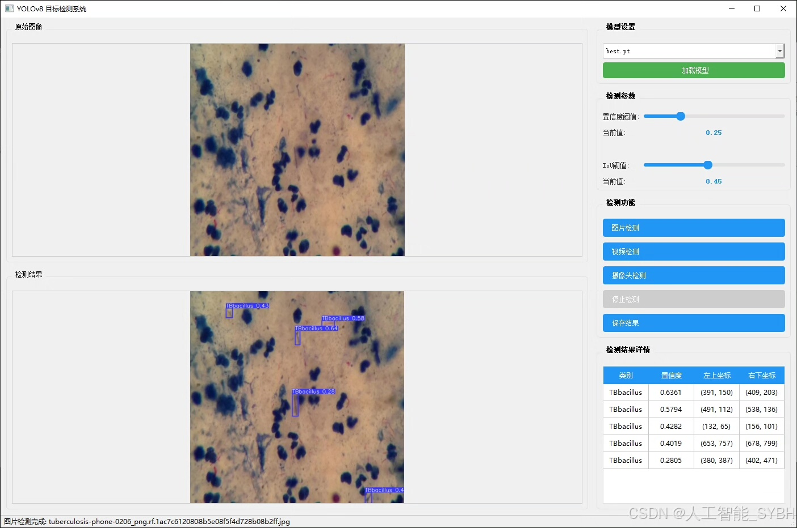
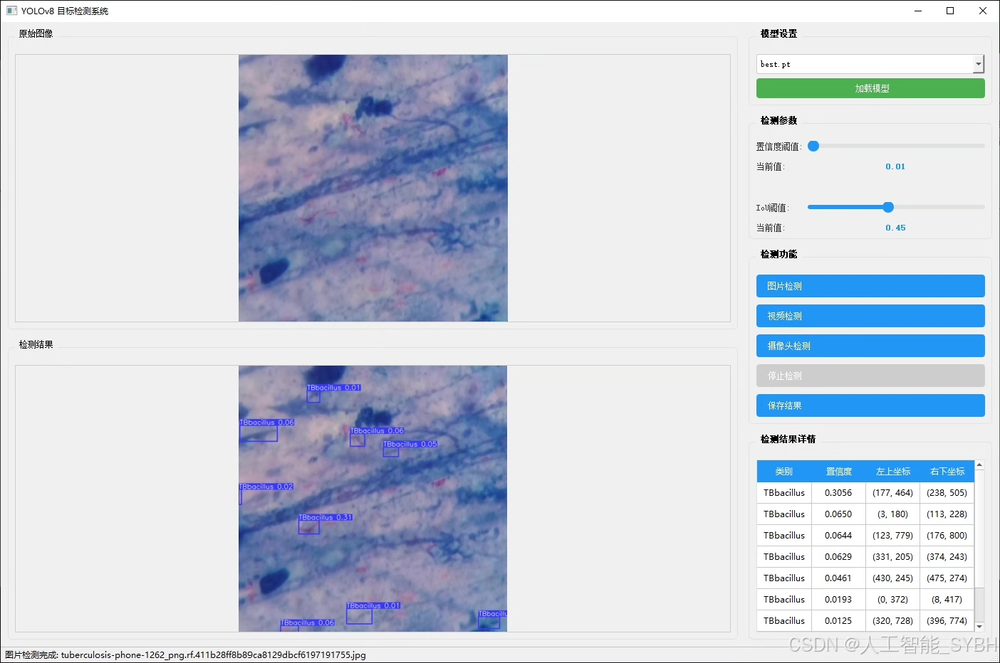
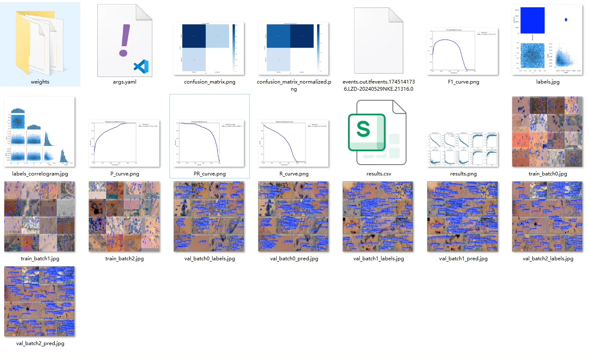
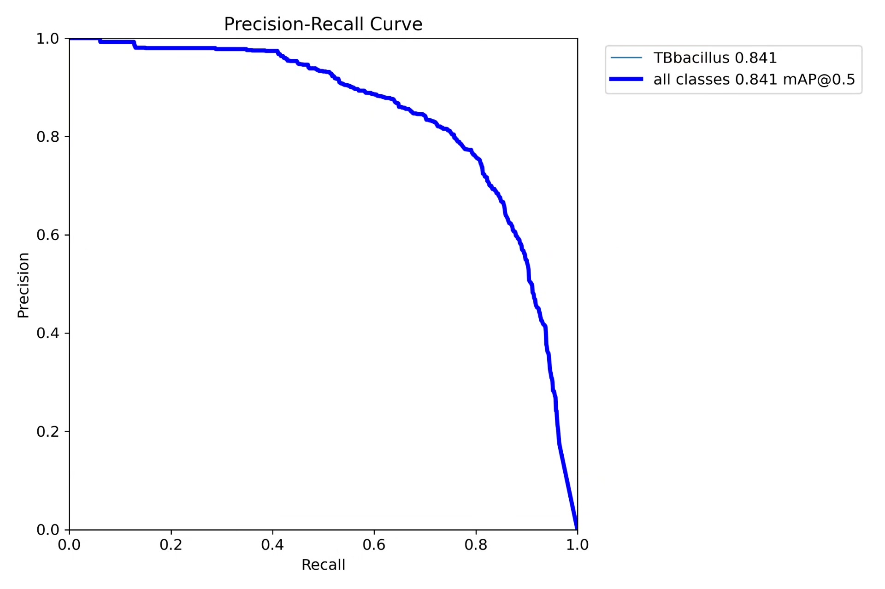
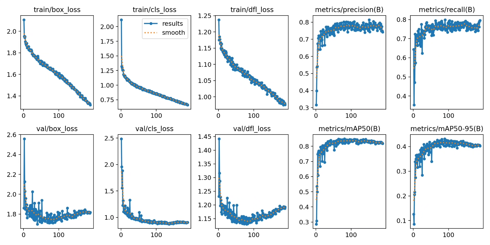
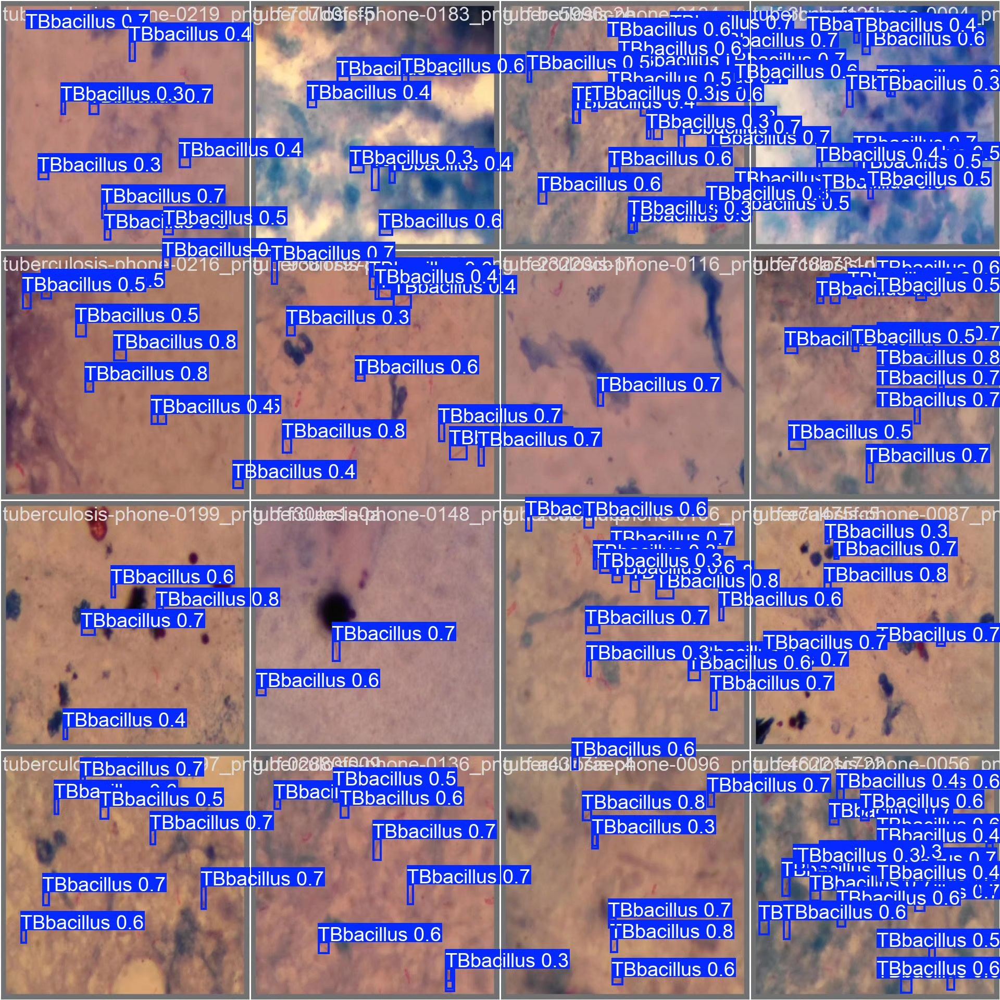
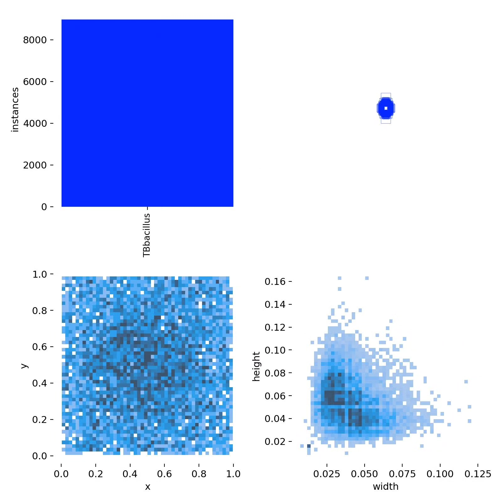
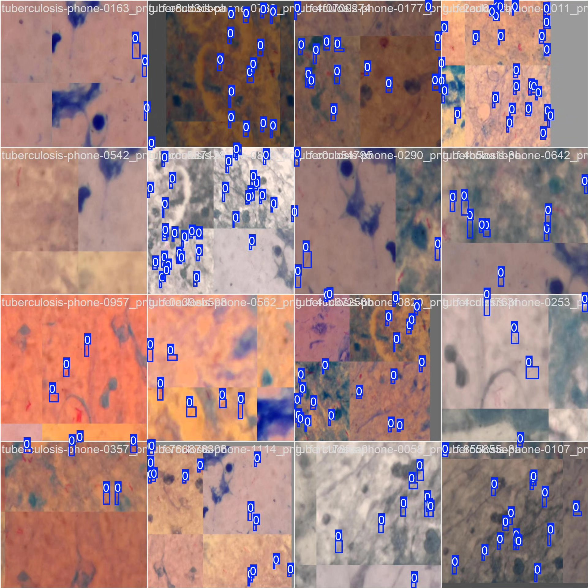

# Based on YOLOv8 deep learning for tuberculosis detection system (YOLOv8+YO)

## Body

Based on the YOLOv8 deep learning framework, this project has developed an efficient automatic detection system for Mycobacterium tuberculosis (TBbacillus) in medical images. The system adopts a single-class (nc:1) detection mode and is optimized for the specific pathogen of TBbacillus. The dataset includes 1098 training images and 122 validation images, which have been enhanced through data augmentation and preprocessing to ensure generalization capabilities of the model. This system can quickly and accurately identify TBbacillus from microscopic images, providing intelligent assistance tools for medical diagnosis. Experimental results show that the system achieves high detection accuracy and recall rate on the validation set, significantly outperforming traditional manual detection methods. The system features flexible deployment, fast detection speed, and high accuracy, which can be integrated into various medical imaging analysis platforms.

The company's products have obtained YOLO official commercial license certification.

We provide after-sales service

After payment, we will provide WeChat ID for any questions, free of charge

Environment configuration: We will provide a tutorial on environment configuration, and WeChat provides Q&A services

Remote installation service: If you need remote configuration, an additional fee of 69 is required, with all fees refunded if the configuration fails (only refund installation fees for older computers)

Retraining dataset: After setting up the environment, you can train on your own computer. If you need us to retrain, just pay 69 plus computing power fees (2.5 yuan/hour)

Full after-sales service

## Images

## Payment

Here is a pay link on Stripe ( https://buy.stripe.com/3cs8yP7sY87d0vu9AB ). Please contact me lonlonago@foxmail.com after funding $89, and I will send you a complete data files , thank you!

